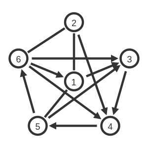
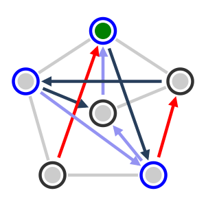
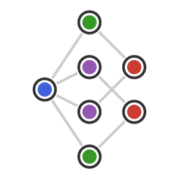
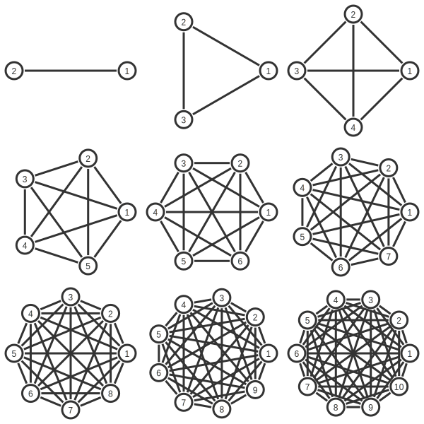

# EuclidGraphs.jl

```@meta
CurrentModule = EuclidGraphs
```

### Simple, lightweight, beautiful graph rendering in VSCode and SVG

Render a graph in directly in VSCode (or to an SVG file) using node and edge features as input. Designed to quickly visualize input and output features for graph neural networks (such as [GraphNets.jl](https://github.com/JuliaMLTools/GraphNets.jl)).

## Example 1: Basic graph
```julia
using EuclidGraphs
nodes = [(0,-10),(0,70),(75,21),(49,-70),(-49,-70),(-75,21)]
g1 = EuclidGraph(nodes, adj_mat=rand(0:1, 6, 6))
g1() # Renders in VSCode
write("basic.svg", g1())
```

```@raw html

```


## Example 2: Styled graph
```julia
g2 = EuclidGraph(
    [(0,-10),(0,70),(75,21),(49,-70),(-49,-70),(-75,21)], 
    adj_mat=rand(0:1, 6, 6),
    node_style=(node) -> NodeStyle(
        inner_fill=(isone(node.features[node.idx]) ? "green" : "#ccc"),
        font_color="white",
        stroke=(iseven(node.idx) ? "blue" : "#333"),
        value=(node) -> nothing,
    ),
    edge_style=(edge) -> EdgeStyle(
        directed_stroke=edge.features[edge.idx],
        arrow_color=edge.features[edge.idx],
        undirected_stroke="#ccc",
    ),
)
num_edges = length(filter(isone, g2.adj_mat))
num_nodes = size(g2.adj_mat, 1)
node_features = zeros(Int, num_nodes)
node_features[rand(1:num_nodes)] = 1
edge_features = rand(["red", "#273E5B", "#273E5B", "#9493F2"], num_edges)
g2(node_features, edge_features) # Renders in VSCode
write("styled.svg", g2(node_features, edge_features))
```

```@raw html

```

## Example 3: The EuclidGraphs.jl logo

```julia
using EuclidGraphs
logo = EuclidGraph(
    [(-50,0),(0,75),(0,25),(0,-25),(0,-75),(50, 25),(50,-25)], 
    node_style=(node) -> NodeStyle(
        inner_fill=node.features[node.idx],
        value=nothing,
    ),
    edge_style=(edge) -> EdgeStyle(stroke="#ccc"),
    fully_connected=false,
)
addbiedges!(logo, [(1,3),(1,2),(1,5),(1,4),(2,6),(5,7),(4,6),(3,7)])
node_features = ["#4162D9","#389825","#9558B2","#9558B2","#389825","#CB3C33","#CB3C33"]
logo(node_features) # Renders in VSCode
write("logo.svg", logo(node_features))
```

```@raw html

```


## Example 4: Shapes

```julia
shapes = [pole triangle square; pentagon hexagon heptagon; octagon nonagon decagon]
svgs = [g(; svg_width=200, svg_height=200) for g in EuclidGraph.(shapes; fully_connected=true)]
grid = SVG(svgs) # Renders in VSCode
write("grid.svg", grid)
```

```@raw html

```

## API index

```@index
```

## Components

```@docs
```